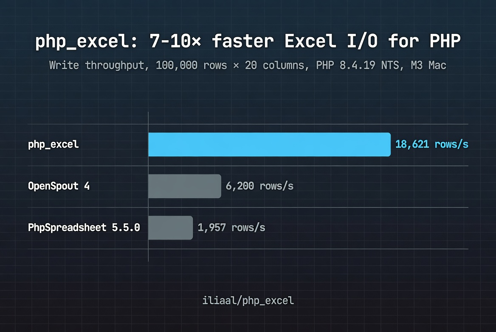

# php_excel

[](https://github.com/iliaal/php_excel/actions/workflows/tests.yml)
[](https://github.com/iliaal/php_excel/actions/workflows/windows.yml)
[](https://github.com/iliaal/php_excel/stargazers)
[](https://github.com/iliaal/php_excel/releases)
[](http://www.php.net/license/3_01.txt)
[](https://x.com/intent/follow?screen_name=iliaa)



Native C extension for reading and writing Excel files in PHP, powered by [LibXL](http://www.libxl.com/). 7-10× faster than PhpSpreadsheet with substantially lower memory pressure. Full XLS and XLSX support: rich text, conditional formatting, formulas, autofilters, form controls, embedded charts, and structured tables. PHP 8.3+ minimum. 2.0 ground-up modernization shipped April 2026.

## 🚀 Install

Via [PIE](https://github.com/php/pie) (PHP Foundation's PECL successor):

```bash
pie install iliaal/php-excel \
  --with-libxl-incdir=/path/to/libxl/include_c \
  --with-libxl-libdir=/path/to/libxl/lib64
```

Or build from source:

```bash
phpize
./configure --with-excel \
  --with-libxl-incdir=/path/to/libxl/include_c \
  --with-libxl-libdir=/path/to/libxl/lib64
make
sudo make install
```

Then add `extension=excel.so` to your `php.ini`.

LibXL is a commercial library; download it from [libxl.com](http://www.libxl.com/) and point the configure flags at its `include_c` and `lib64` directories.

## 🛠️ Getting started

```php
<?php
$book = new ExcelBook(null, null, true); // xlsx mode
$book->setLocale('UTF-8');

$sheet = $book->addSheet('Sheet1');

$data = [
    [1, 1500, 'John', 'Doe'],
    [2,  750, 'Jane', 'Doe'],
];

$row = 1;
foreach ($data as $item) {
    $sheet->writeRow($row++, $item);
}

// formula
$sheet->write($row, 1, '=SUM(B1:B3)');

// date with format
$dateFormat = new ExcelFormat($book);
$dateFormat->numberFormat(ExcelFormat::NUMFORMAT_DATE);
$sheet2 = $book->addSheet('Sheet2');
$sheet2->write(1, 0, (new DateTime('2024-08-02'))->getTimestamp(), $dateFormat, ExcelFormat::AS_DATE);

$book->save('output.xlsx');
```

## 📊 Performance

Write 100,000 rows × 20 columns vs PhpSpreadsheet 5.5.0 on PHP 8.4.19 NTS, Apple M3:

| Rows | Cells | php_excel | PhpSpreadsheet | Speedup |
|------|-------|-----------|----------------|---------|
| 1,000 | 20K | 0.05s / 85 MB | 0.45s / 162 MB | 10× |
| 10,000 | 200K | 0.55s / 153 MB | 4.59s / 282 MB | 9× |
| 50,000 | 1M | 2.72s / 508 MB | 24.7s / 790 MB | 9× |
| 100,000 | 2M | 5.37s / 908 MB | 51.1s / 1,415 MB | 10× |

Read performance is similar: 8-9× faster than PhpSpreadsheet, 3× faster than OpenSpout (with proportional memory tradeoff vs OpenSpout's flat 130 MB streaming model).

### Why PhpSpreadsheet OOMs and php_excel doesn't

PHP's `memory_get_peak_usage()` reports about 2 MB for php_excel because LibXL allocates on the C heap, invisible to PHP's `memory_limit`. PhpSpreadsheet allocates in PHP's memory — it OOMs on 10,000 rows in a default 128 MB PHP-FPM pool. php_excel writes 100,000 rows in the same pool without raising the limit.

That's the practical difference. Bench numbers tell you it's faster; this tells you it's the difference between "report generates" and "report 500s in production."

## 📦 Classes

| Class | Description |
|-------|-------------|
| ExcelBook | Workbook management: create, load, save, sheets, fonts, formats, pictures |
| ExcelSheet | Cell read/write, formatting, printing, protection, hyperlinks, data validation |
| ExcelFormat | Cell formatting: colors, borders, number formats, alignment, patterns |
| ExcelFont | Font properties: name, size, bold, italic, underline, color |
| ExcelAutoFilter | AutoFilter operations and sorting |
| ExcelFilterColumn | Filter column criteria |
| ExcelRichString | Mixed-font text in a single cell |
| ExcelFormControl | Form controls: checkboxes, dropdowns, spinners, buttons |
| ExcelConditionalFormat | Conditional formatting style rules |
| ExcelConditionalFormatting | Conditional formatting ranges and rule application |
| ExcelCoreProperties | Workbook metadata: title, author, dates, categories |
| ExcelTable | Structured table support (xlsx) |

2.0 added six new classes (ExcelRichString, ExcelFormControl, ExcelConditionalFormat, ExcelConditionalFormatting, ExcelCoreProperties, ExcelTable) plus full arginfo coverage: 399 typed parameters and 277 typed return values across the surface.

## php.ini settings

Store LibXL credentials in `php.ini` instead of source code. The extension reads them automatically when you pass `null` to the constructor.

```ini
[excel]
excel.license_name="YOUR_LICENSE_NAME"
excel.license_key="YOUR_LICENSE_KEY"
excel.skip_empty=0
```

## 🔗 PHP Performance Toolkit

Companion native PHP extensions for high-throughput PHP workloads:

- **[mdparser](https://github.com/iliaal/mdparser)** — Native CommonMark + GFM markdown parser. 15-30× faster than pure-PHP libraries (Parsedown, cebe, michelf). Powered by cmark-gfm.
- **[php_clickhouse](https://github.com/iliaal/php_clickhouse)** — Native ClickHouse client speaking the wire protocol directly. Picks up where SeasClick left off.

## 📚 Read more

Full background, design rationale, and benchmark methodology in the launch post: [php_excel 2.0: The C Extension for Excel That PHP Should Have Had All Along](https://ilia.ws/blog/php-excel-2-0-the-c-extension-for-excel-that-php-should-have-had-all-along).

API reference lives in `docs/`; usage examples live in `tests/`.

## License

PHP License 3.01. See [LICENSE](LICENSE).

LibXL itself is commercial — see [libxl.com](http://www.libxl.com/) for licensing.

---

[Follow @iliaa on X](https://x.com/iliaa) • [Blog](https://ilia.ws) • If this sped up your stack, ⭐ star it!
