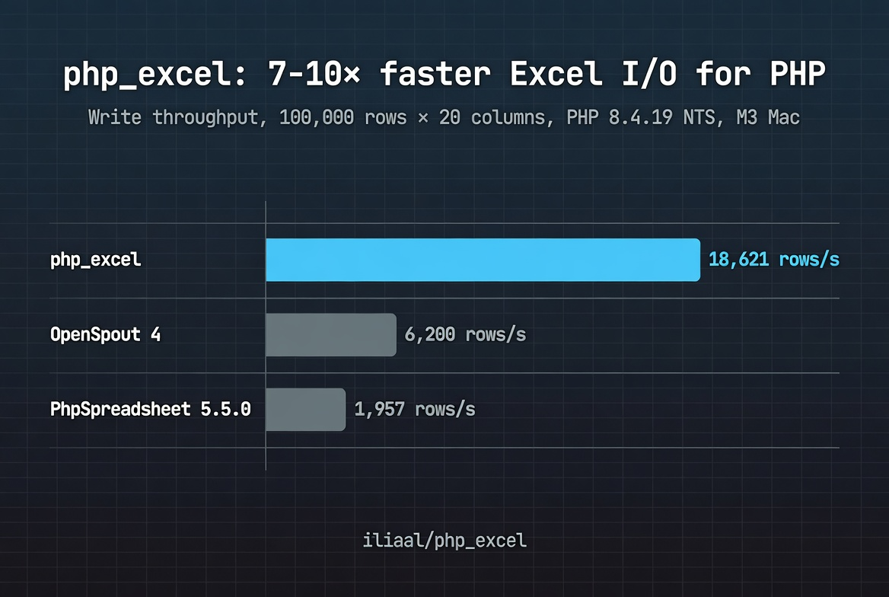

# php_excel

[](https://github.com/iliaal/php_excel/actions/workflows/tests.yml)
[](https://github.com/iliaal/php_excel/actions/workflows/windows.yml)
[](https://github.com/iliaal/php_excel/stargazers)
[](https://github.com/iliaal/php_excel/releases)
[](http://www.php.net/license/3_01.txt)
[](https://x.com/intent/follow?screen_name=iliaa)



Native C extension for reading and writing Excel files in PHP, powered by [LibXL](http://www.libxl.com/). 7-10× faster than PhpSpreadsheet with substantially lower memory pressure. Full XLS and XLSX support: rich text, conditional formatting, formulas, autofilters, form controls, embedded charts, and structured tables. PHP 8.1+ minimum. 2.0 ground-up modernization shipped April 2026.

## 🚀 Install

Via [PIE](https://github.com/php/pie) (PHP Foundation's PECL successor):

```bash
pie install iliaal/php-excel \
  --with-libxl-incdir=/path/to/libxl/include_c \
  --with-libxl-libdir=/path/to/libxl/lib64
```

Or build from source:

```bash
phpize
./configure --with-excel \
  --with-libxl-incdir=/path/to/libxl/include_c \
  --with-libxl-libdir=/path/to/libxl/lib64
make
sudo make install
```

Then add `extension=excel.so` to your `php.ini`.

LibXL is a commercial library; download it from [libxl.com](http://www.libxl.com/) and point the configure flags at its `include_c` and `lib64` directories.

## 🛠️ Getting started

```php
<?php
$book = new ExcelBook(null, null, true); // xlsx mode
$book->setLocale('UTF-8');

$sheet = $book->addSheet('Sheet1');

$data = [
    [1, 1500, 'John', 'Doe'],
    [2,  750, 'Jane', 'Doe'],
];

$row = 1;
foreach ($data as $item) {
    $sheet->writeRow($row++, $item);
}

// formula
$sheet->write($row, 1, '=SUM(B1:B3)');

// untrusted input: AS_TEXT stores the string verbatim, with no '=' formula
// promotion. It takes a string, so cast first. See SECURITY.md.
$sheet->write($row, 2, (string) $userSuppliedValue, null, ExcelFormat::AS_TEXT);

// date with format
$dateFormat = new ExcelFormat($book);
$dateFormat->numberFormat(ExcelFormat::NUMFORMAT_DATE);
$sheet2 = $book->addSheet('Sheet2');
$sheet2->write(1, 0, (new DateTime('2024-08-02'))->getTimestamp(), $dateFormat, ExcelFormat::AS_DATE);

$book->save('output.xlsx');
```

`save()` stages the workbook to a temporary sibling file and renames it into place, so a failed save leaves the destination untouched. If the rename fails, local-path saves fail closed (return `false`); stream wrappers that omit `rename()` fall back to a direct write with a warning. Failed handle creation and rejected header, footer, font-size, and staging inputs emit warnings naming the cause. Suppress them with `@` only where you handle `false` explicitly.

## 📊 Performance

Write 100,000 rows × 20 columns vs PhpSpreadsheet 5.5.0 on PHP 8.4.19 NTS, Apple M3:

| Rows | Cells | php_excel | PhpSpreadsheet | Speedup |
|------|-------|-----------|----------------|---------|
| 1,000 | 20K | 0.05s / 85 MB | 0.45s / 162 MB | 10× |
| 10,000 | 200K | 0.55s / 153 MB | 4.59s / 282 MB | 9× |
| 50,000 | 1M | 2.72s / 508 MB | 24.7s / 790 MB | 9× |
| 100,000 | 2M | 5.37s / 908 MB | 51.1s / 1,415 MB | 10× |

Reads are 8-9× faster than PhpSpreadsheet and 3× faster than OpenSpout, at the cost of memory that grows with the file, where OpenSpout streams in a flat 130 MB.

For read-heavy import paths, prefer `readRow()`, `readCol()`, or `readRange()` over per-cell `read()` loops. Pass `false` for `$read_formula` when cached values are enough, to skip the per-cell formula-text probe. For sparse sheets, `readSparseRow()` and `readSparseCol()` return only occupied cells keyed by their original column or row indexes.

### Bulk-read bounds and indexes

Cell coordinates are zero-based. `lastRow()` and `lastCol()` return the
**exclusive** end of the used range, while bulk readers take **inclusive** end
coordinates. Subtract one when passing a used-range end to `readRange()`;
`readRow()` and `readCol()` do this automatically for their default end of `-1`.
Check that a range is nonempty before subtracting and reading it. The used
range can extend beyond nonempty values, for example because of formatting.

Dense readers return packed arrays keyed from zero, even when the requested
range starts elsewhere. Sparse readers keep the original sheet indexes and
omit empty cells, but retain values such as numeric zero and boolean false.

```php
$sheet = $book->addSheet('Read example');
$sheet->write(1, 1, 'A');
$sheet->write(1, 3, false);
$sheet->write(3, 1, 0);

$sheet->readRow(1, 1, 3);       // [0 => 'A', 1 => '', 2 => false]
$sheet->readSparseRow(1, 1, 3); // [1 => 'A', 3 => false]

// Read the data from row/column 1 through the last used cell.
$rowEnd = $sheet->lastRow();
$colEnd = $sheet->lastCol();
$rows = ($rowEnd > 1 && $colEnd > 1)
    ? $sheet->readRange(1, $rowEnd - 1, 1, $colEnd - 1)
    : [];
// $rows[0][0] corresponds to sheet cell (1, 1).
```

### Native memory and PHP's `memory_limit`

PHP's `memory_get_peak_usage()` reports about 2 MB for php_excel in the benchmark above because LibXL allocates on the C heap, outside PHP's memory manager and `memory_limit`. [PHP's memory counters](https://www.php.net/manual/en/function.memory-get-usage.php) do not include these native allocations, even with `real_usage` set to `true`. This allows php_excel to write 100,000 rows without raising PHP's 128 MB limit, but the same run still peaked at 908 MB of process virtual memory (VmPeak). `save()` without a path, to a stream-wrapper URL, or while `open_basedir` is set copies the entire workbook into a PHP string, so that copy also counts against `memory_limit`.

php_excel can still run out of memory or hit an operating-system or container memory limit. Size your workers and concurrency using process-level memory measurements (such as resident set size), not PHP's memory counters alone. PHP arrays, strings, and buffered stream input also consume PHP-managed memory and remain subject to `memory_limit`; see [stream-loading limits](SECURITY.md#memory-use-when-loading-buffering).

## 📦 Classes

| Class | Description |
|-------|-------------|
| ExcelBook | Workbook management: create, load, save, sheets, fonts, formats, pictures |
| ExcelSheet | Cell read/write, formatting, printing, protection, hyperlinks, data validation |
| ExcelFormat | Cell formatting: colors, borders, number formats, alignment, patterns |
| ExcelFont | Font properties: name, size, bold, italic, underline, color |
| ExcelAutoFilter | AutoFilter operations and sorting |
| ExcelFilterColumn | Filter column criteria |
| ExcelRichString | Mixed-font text in a single cell |
| ExcelFormControl | Form controls: checkboxes, dropdowns, spinners, buttons |
| ExcelConditionalFormat | Conditional formatting style rules |
| ExcelConditionalFormatting | Conditional formatting ranges and rule application |
| ExcelCoreProperties | Workbook metadata: title, author, dates, categories |
| ExcelTable | Structured table support (xlsx) |

2.0 added six new classes (ExcelRichString, ExcelFormControl, ExcelConditionalFormat, ExcelConditionalFormatting, ExcelCoreProperties, ExcelTable) plus full arginfo coverage: 399 typed parameters and 277 typed return values across the surface.

## php.ini settings

Store LibXL credentials in `php.ini` instead of source code. The extension reads them automatically when you pass `null` to the constructor.

```ini
[excel]
excel.license_name="YOUR_LICENSE_NAME"
excel.license_key="YOUR_LICENSE_KEY"
excel.skip_empty=0
```

### Skipping empty writes

`excel.skip_empty` controls `write()`, `writeRow()`, and `writeCol()`:

- `0` (default): write `null` as a blank cell and write empty strings.
- `1`: skip `null`; still write empty strings.
- `2`: skip both `null` and empty strings with the default data type.

A skipped write returns success but leaves the existing cell value and format
unchanged. It does **not** clear the cell. Bulk writes still advance to the next
coordinate, so skipped values leave gaps rather than shifting later values.
Numeric zero, boolean `false`, and the string `'0'` are never skipped.

```php
$sheet->writeRow(1, ['keep', 'replace', 'old'], 1);
$previous = ini_set('excel.skip_empty', '2');
$sheet->writeRow(1, [null, '', 0], 1);
$sheet->readRow(1, 1, 3); // ['keep', 'replace', 0.0]
ini_set('excel.skip_empty', $previous);
```

The setting is request-wide, not per workbook, and can be changed with
`ini_set()`. Restore the previous value after a temporary override. To clear an
existing cell with `null`, use mode `0`. An explicit `ExcelFormat::AS_TEXT`
writes an empty string even in mode `2`; `null` still follows `excel.skip_empty`
regardless of the data type.

## 🔗 Native PHP extensions

Companion native PHP extensions:

- **[mdparser](https://github.com/iliaal/mdparser)**: native CommonMark + GFM markdown parser via md4c. 15-30× faster than pure-PHP libraries.
- **[php_clickhouse](https://github.com/iliaal/php_clickhouse)**: native ClickHouse client speaking the wire protocol directly. Picks up where SeasClick left off.
- **[pdo_duckdb](https://github.com/iliaal/pdo_duckdb)**: PDO driver for DuckDB, analytical SQL in your PHP stack.
- **[fastjson](https://github.com/iliaal/fastjson)**: drop-in faster `ext/json`, backed by yyjson. 6× encode, 2.7× decode, 5× validate.
- **[phpser](https://github.com/iliaal/phpser)**: decoder-optimized binary serializer for cache workloads. Faster than igbinary on packed numerics and DTO batches.
- **[fast_uuid](https://github.com/iliaal/fast_uuid)**: high-throughput UUID generation (v1/v4/v7), batched CSPRNG and SIMD hex formatter, ramsey-compatible API.
- **[fastchart](https://github.com/iliaal/fastchart)**: native chart-rendering extension. 38 chart types behind one fluent OO API, SVG-canonical with PNG/JPG/WebP and optional PDF output.
- **[statgrab](https://github.com/iliaal/statgrab)**: system statistics (CPU, memory, disk, network) via libstatgrab, no parsing /proc by hand.
- **[phonetic](https://github.com/iliaal/phonetic)**: native phonetic name matching (Double Metaphone, Beider-Morse, Daitch-Mokotoff, NYSIIS, Match Rating), the encoders PHP core lacks.

## 📚 Read more

The launch post covers background, design rationale, and benchmark methodology: [php_excel 2.0: The C Extension for Excel That PHP Should Have Had All Along](https://ilia.ws/blog/php-excel-2-0-the-c-extension-for-excel-that-php-should-have-had-all-along).

API reference lives in `docs/`; usage examples live in `tests/`.

## License

PHP License 3.01. See [LICENSE](LICENSE).

LibXL itself is commercial. See [libxl.com](http://www.libxl.com/) for licensing.

---

[Follow @iliaa on X](https://x.com/iliaa) • [Blog](https://ilia.ws) • If this sped up your stack, ⭐ star it!
